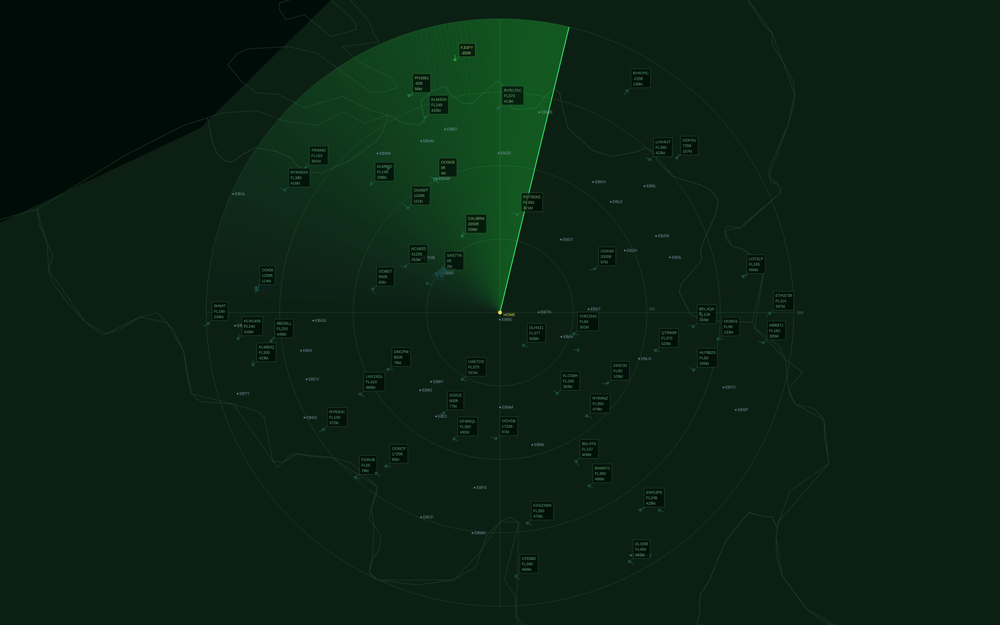

# omarchy-stuff

Miscellaneous goodies for [Omarchy](https://omarchy.org/) (Arch + Hyprland).

## Screensaver: SkyRadar

A live air-traffic radar screensaver — a fullscreen Qt Quick app that draws a
phosphor-style scope with a rotating sweep and a trailing halo, a real
geographic map (land/sea + country borders), and live ADS-B aircraft shown as
ATC-style data blocks (callsign / flight level / ground speed).



- **Smooth vector rendering** (anti-aliased, full resolution — not a terminal hack)
- **Live traffic** from the [OpenSky Network](https://opensky-network.org/) over a configurable radius
- **Data blocks** per aircraft: callsign, flight level (above FL100, dimmed), ground speed
- Aerodrome codes (Belgium) + a `HOME` marker
- Exits on any key/mouse input or when the lock screen appears

### Requirements

- `qml6` (Qt 6 QML runtime) — on Arch: `pacman -S qt6-declarative`
- A Wayland session (Omarchy/Hyprland)

### Install

```bash
cd screensavers
./install.sh
```

This copies the app to `~/.local/share/skyradar-screensaver/` and installs a
`/usr/bin/omarchy-launch-screensaver` override (the original is backed up to
`omarchy-launch-screensaver.orig`).

### Try it

```bash
omarchy-launch-screensaver force
```

Press any key or move the mouse to exit. It also triggers automatically when
the Omarchy screensaver idle timeout is reached.

### Configuration

Edit the top of `screensavers/skyradar-screensaver.qml`:

| Setting | Default | Meaning |
|---|---|---|
| `centerLat` / `centerLon` | 50.7806, 4.7696 (Beauvechain) | Radar centre — set your own location |
| `radiusKm` | 100 | Scope radius in km |
| `fontFam` | JetBrainsMono Nerd Font | Label font |

Map data (`map.js`) is derived from [Natural Earth](https://www.naturalearthdata.com/)
(land + admin-0 boundaries), pre-filtered to the centre region.

### Uninstall

```bash
sudo mv /usr/bin/omarchy-launch-screensaver.orig /usr/bin/omarchy-launch-screensaver
rm -rf ~/.local/share/skyradar-screensaver
```
